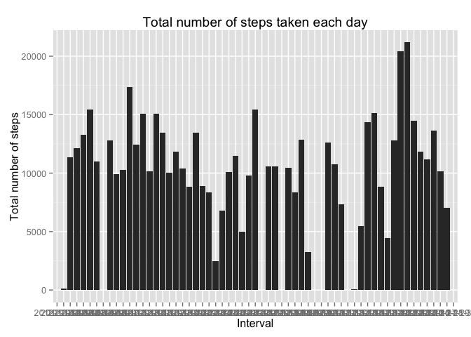
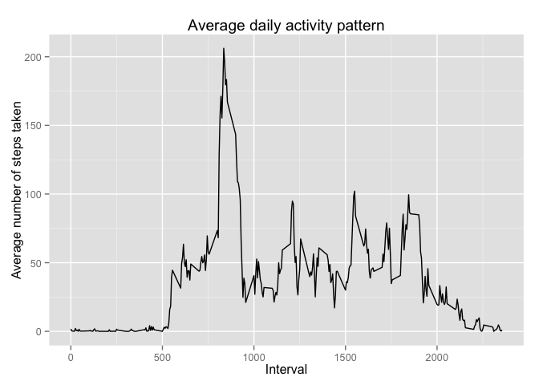
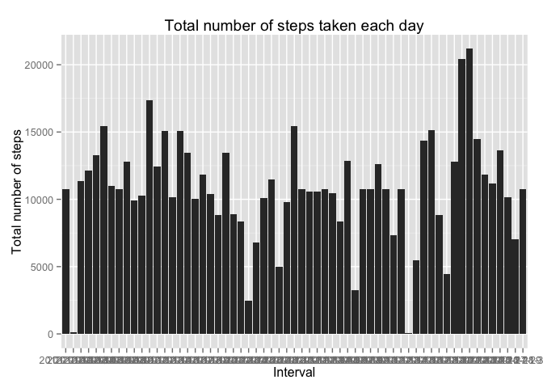
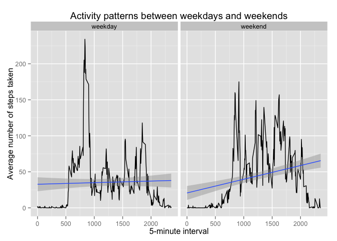

# PA1_template
Eric Tchepannou  
19 July 2015  

## Loading and preprocessing the data


```
## 
## Attaching package: 'dplyr'
## 
## The following object is masked from 'package:stats':
## 
##     filter
## 
## The following objects are masked from 'package:base':
## 
##     intersect, setdiff, setequal, union
```

## What is mean total number of steps taken per day?

For this part of the assignment, you can ignore the missing values in the dataset.

### Calculate the total number of steps taken per day


```r
total_steps_per_day <- aggregate(data$steps, by=list(data$date), FUN=sum)
str(total_steps_per_day)
```

```
## 'data.frame':	61 obs. of  2 variables:
##  $ Group.1: Factor w/ 61 levels "2012-10-01","2012-10-02",..: 1 2 3 4 5 6 7 8 9 10 ...
##  $ x      : int  NA 126 11352 12116 13294 15420 11015 NA 12811 9900 ...
```

```r
head(total_steps_per_day)
```

```
##      Group.1     x
## 1 2012-10-01    NA
## 2 2012-10-02   126
## 3 2012-10-03 11352
## 4 2012-10-04 12116
## 5 2012-10-05 13294
## 6 2012-10-06 15420
```

### If you do not understand the difference between a histogram and a barplot, research the difference between them. Make a histogram of the total number of steps taken each day


```
## Warning in loop_apply(n, do.ply): Removed 8 rows containing missing values
## (position_stack).
```

 

### Calculate and report the mean and median of the total number of steps taken per day


```r
mean_steps_per_day <- aggregate(data$steps, by=list(data$date), FUN=mean, na.rm = T)
str(mean_steps_per_day)
```

```
## 'data.frame':	61 obs. of  2 variables:
##  $ Group.1: Factor w/ 61 levels "2012-10-01","2012-10-02",..: 1 2 3 4 5 6 7 8 9 10 ...
##  $ x      : num  NaN 0.438 39.417 42.069 46.16 ...
```

```r
head(mean_steps_per_day)
```

```
##      Group.1        x
## 1 2012-10-01      NaN
## 2 2012-10-02  0.43750
## 3 2012-10-03 39.41667
## 4 2012-10-04 42.06944
## 5 2012-10-05 46.15972
## 6 2012-10-06 53.54167
```

```r
median_steps_per_day <- aggregate(data$steps, by=list(data$date), FUN=median, na.rm=T)
str(median_steps_per_day)
```

```
## 'data.frame':	61 obs. of  2 variables:
##  $ Group.1: Factor w/ 61 levels "2012-10-01","2012-10-02",..: 1 2 3 4 5 6 7 8 9 10 ...
##  $ x      : num  NA 0 0 0 0 0 0 NA 0 0 ...
```

```r
head(median_steps_per_day)
```

```
##      Group.1  x
## 1 2012-10-01 NA
## 2 2012-10-02  0
## 3 2012-10-03  0
## 4 2012-10-04  0
## 5 2012-10-05  0
## 6 2012-10-06  0
```

## What is the average daily activity pattern?

### Make a time series plot (i.e. type = "l") of the 5-minute interval (x-axis) and the average number of steps taken, averaged across all days (y-axis)

 

### Which 5-minute interval, on average across all the days in the dataset, contains the maximum number of steps?


```r
index <- which(mean_steps_per_intv$x == max(mean_steps_per_intv$x))
mean_steps_per_intv$Group.1[index]
```

```
The 5-minute interval with the maximum number of steps [1] 835
```

## Imputing missing values

### Calculate and report the total number of missing values in the dataset (i.e. the total number of rows with NAs)

```r
length(data[is.na(data)])
```

```
## [1] 2304
```

### Use the mean to replace NAs

```r
mean_steps_per_intv <- aggregate(data$steps, by=list(data$interval), FUN=mean, na.rm = T)
```

### Create a new dataset that is equal to the original dataset but with the missing data filled in.

```r
new_data <- mutate(data, new_steps = ifelse(is.na(data$steps), mean_steps_per_intv$x, data$steps))
str(new_data)
```

```
## 'data.frame':	17568 obs. of  4 variables:
##  $ steps    : int  NA NA NA NA NA NA NA NA NA NA ...
##  $ date     : Factor w/ 61 levels "2012-10-01","2012-10-02",..: 1 1 1 1 1 1 1 1 1 1 ...
##  $ interval : int  0 5 10 15 20 25 30 35 40 45 ...
##  $ new_steps: num  1.717 0.3396 0.1321 0.1509 0.0755 ...
```

```r
head(new_data)
```

```
##   steps       date interval new_steps
## 1    NA 2012-10-01        0 1.7169811
## 2    NA 2012-10-01        5 0.3396226
## 3    NA 2012-10-01       10 0.1320755
## 4    NA 2012-10-01       15 0.1509434
## 5    NA 2012-10-01       20 0.0754717
## 6    NA 2012-10-01       25 2.0943396
```

### Make a histogram of the total number of steps taken each day
 

Calculate and report the mean and median total number of steps taken per day


```r
new_mean_steps_per_day <- aggregate(new_data$new_steps, by = list(new_data$date), FUN = mean, na.rm = T)
str(new_mean_steps_per_day)
```

```
## 'data.frame':	61 obs. of  2 variables:
##  $ Group.1: Factor w/ 61 levels "2012-10-01","2012-10-02",..: 1 2 3 4 5 6 7 8 9 10 ...
##  $ x      : num  37.383 0.438 39.417 42.069 46.16 ...
```

```r
head(new_mean_steps_per_day)
```

```
##      Group.1        x
## 1 2012-10-01 37.38260
## 2 2012-10-02  0.43750
## 3 2012-10-03 39.41667
## 4 2012-10-04 42.06944
## 5 2012-10-05 46.15972
## 6 2012-10-06 53.54167
```

```r
new_median_steps_per_day <- aggregate(new_data$new_steps, by = list(new_data$date), FUN = median, na.rm = T)
str(new_median_steps_per_day)
```

```
## 'data.frame':	61 obs. of  2 variables:
##  $ Group.1: Factor w/ 61 levels "2012-10-01","2012-10-02",..: 1 2 3 4 5 6 7 8 9 10 ...
##  $ x      : num  34.1 0 0 0 0 ...
```

```r
head(new_median_steps_per_day)
```

```
##      Group.1        x
## 1 2012-10-01 34.11321
## 2 2012-10-02  0.00000
## 3 2012-10-03  0.00000
## 4 2012-10-04  0.00000
## 5 2012-10-05  0.00000
## 6 2012-10-06  0.00000
```

The value differ from the estimates from the first part of the assignment. Imputing missing data on the estimates will increase the total daily number of steps taken.

## Are there differences in activity patterns between weekdays and weekends?

### Create a new factor variable in the dataset with two levels – “weekday” and “weekend” indicating whether a given date is a weekday or weekend day.

```r
day_data <- mutate(new_data, day = ifelse(weekdays(as.Date(new_data$date), T) == "Sat" | weekdays(as.Date(new_data$date), T) == "Sun", "weekend", "weekday"))
day_data$day <- as.factor(day_data$day)
str(day_data)
```

```
## 'data.frame':	17568 obs. of  5 variables:
##  $ steps    : int  NA NA NA NA NA NA NA NA NA NA ...
##  $ date     : Factor w/ 61 levels "2012-10-01","2012-10-02",..: 1 1 1 1 1 1 1 1 1 1 ...
##  $ interval : int  0 5 10 15 20 25 30 35 40 45 ...
##  $ new_steps: num  1.717 0.3396 0.1321 0.1509 0.0755 ...
##  $ day      : Factor w/ 2 levels "weekday","weekend": 1 1 1 1 1 1 1 1 1 1 ...
```

```r
head(day_data)
```

```
##   steps       date interval new_steps     day
## 1    NA 2012-10-01        0 1.7169811 weekday
## 2    NA 2012-10-01        5 0.3396226 weekday
## 3    NA 2012-10-01       10 0.1320755 weekday
## 4    NA 2012-10-01       15 0.1509434 weekday
## 5    NA 2012-10-01       20 0.0754717 weekday
## 6    NA 2012-10-01       25 2.0943396 weekday
```

 
